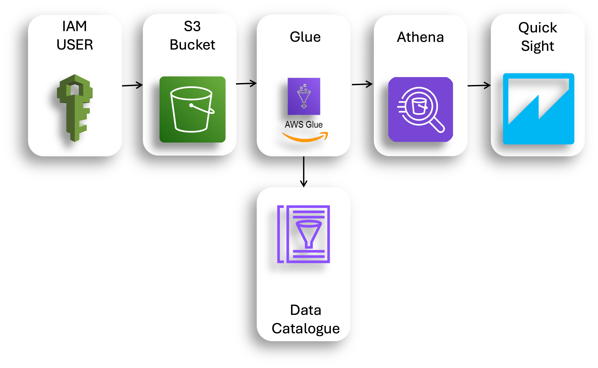

# AWS Order Data Project

This project demonstrates how I leveraged various Amazon Web Services (AWS) to build a pipeline for storing, querying, and visualizing order data. The solution involves S3 for storage, Glue for data cataloging, Athena for querying, and QuickSight for visualization. All resources were created and managed directly within the AWS Management Console.

## Project Overview

The goal of the project is to optimize the querying and visualization of order data using AWS services. Here's a breakdown of the key steps:

- **Data Storage:** Using Amazon S3 to store order data in a structured, partitioned format for efficient querying.
- **Data Cataloging:** Automating data discovery and organization using AWS Glue Crawlers.
- **Querying:** Leveraging AWS Athena to run SQL queries directly on the data stored in S3, optimizing queries using partitioning.
- **Visualization:** Creating visual dashboards in Amazon QuickSight to provide quick insights into the data, with enhanced performance via SPICE (Super-fast, Parallel, In-memory Calculation Engine).

## Steps Involved

1. **User Setup**:
    - Created a new IAM user with Admin access to manage the AWS resources needed for the project.

2. **S3 Bucket Setup**:
    - Created an Amazon S3 bucket to store the order data.
    - Used folders and subfolders within the S3 bucket, following a naming convention like `Snapshot=YYYY-MM-DD` (e.g., `Snapshot=2027-01-01`) for partitioning the data.

3. **Data Upload**:
    - Uploaded order data in CSV format to the appropriate S3 partitions.
    - Ensured that each partition represented a snapshot of data from a specific date.

4. **AWS Glue Crawler**:
    - Set up an AWS Glue Crawler to detect and catalog the data within the S3 bucket.
    - The crawler automatically identified the data structure and stored metadata in the Glue Data Catalog, making it easier to query with Athena.

5. **Athena Queries**:
    - Used AWS Athena to run SQL queries on the partitioned data in S3.
    - Optimized queries by specifying partitions, ensuring that only relevant subsets of data were queried, thus reducing costs and improving performance.

6. **QuickSight Setup**:
    - Created a QuickSight account and connected it to Athena to enable seamless visualization of the data.
    - Imported the dataset into SPICE (Amazon QuickSight’s in-memory engine) for faster performance.

7. **SPICE Import**:
    - Imported the Athena query results into SPICE for faster, in-memory data analysis and quicker visualizations.

8. **Dashboard Creation**:
    - Created and published interactive dashboards in QuickSight, enabling stakeholders to visualize trends, patterns, and insights from the order data.

## Technologies Used

- **Amazon S3**: Used for storage of the order data.
- **AWS Glue**: Used for automating data cataloging and discovery.
- **Amazon Athena**: SQL querying engine for querying data stored in S3.
- **Amazon QuickSight**: Data visualization tool for creating interactive dashboards.
- **SPICE**: Amazon QuickSight’s in-memory engine for faster data analysis.

## Architecture Diagram

Below is an architecture diagram of the setup for the project:

## PowerPoint Presentation

For a detailed walkthrough of the project, including screenshots of the AWS setup, data flow, and visualizations, please refer to the PowerPoint presentation below:

[Download the AWS Order Data Project Presentation](docs/AWS_Order_Data_Project.pptx)

## Conclusion

This project showcases how to efficiently manage and analyze large datasets using a fully managed AWS architecture. By utilizing S3, Glue, Athena, and QuickSight, I was able to optimize the querying process and provide interactive visualizations of the order data. The project also highlights how partitioning data and using in-memory computation (SPICE) in QuickSight can lead to significant cost and performance improvements.

## Future Enhancements

- **Automation**: Implementing Lambda functions to automate data uploads and queries.
- **Machine Learning Integration**: Using AWS SageMaker to build predictive models based on the order data.
- **Real-time Dashboards**: Configuring AWS Kinesis to stream data into QuickSight for real-time analytics.

## License

This project is licensed under the MIT License - see the [LICENSE](LICENSE) file for details.
